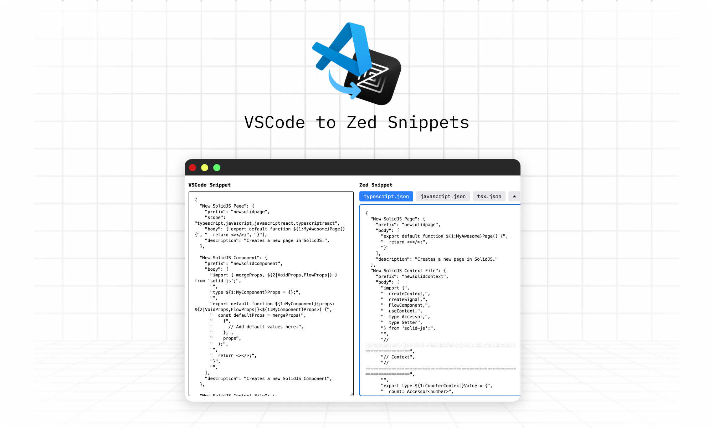

## vscode-to-zed-snippets

A very simple web app to convert vscode snippets to zed.

Currently supports a mapping for:

- `tsx.json`
- `typescript.json`
- `javascript.json`
- `rust.json`

If you want to add more, edit `utils/convert-vscode-to-zed-snippets.ts`
